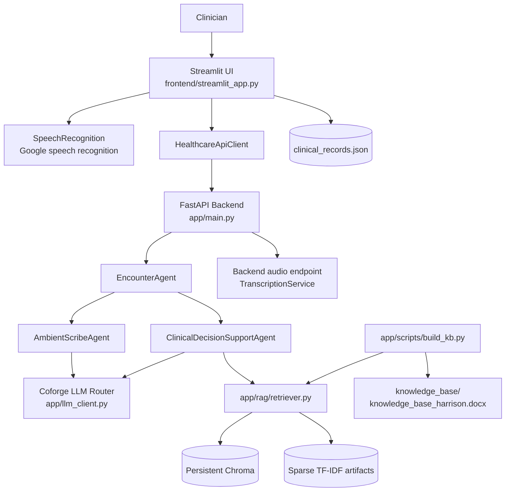

# Agent Pod

Agent Pod is a workspace containing related clinical documentation and clinical decision-support prototypes. The canonical runnable application is `Clinical_decision_support/`. It provides a Streamlit interface, FastAPI backend, ambient scribe agent, retrieval-augmented clinical decision support, a local Word knowledge base, and a Coforge LLM integration.

This is an educational prototype. It is not a medical device and must not replace a licensed clinician, emergency services, local protocols, or professional clinical judgment.

## Table of Contents

- [Repository Scope](#repository-scope)
- [1. Project Overview](#1-project-overview)
- [2. Key Features](#2-key-features)
- [3. High-Level Architecture](#3-high-level-architecture)
- [4. Repository Layout](#4-repository-layout)
- [5. Prerequisites](#5-prerequisites)
- [6. Installation](#6-installation)
- [7. Configuration](#7-configuration)
- [8. Running the Canonical Application](#8-running-the-canonical-application)
- [9. End-to-End Data Flows](#9-end-to-end-data-flows)
- [10. Knowledge Base and RAG](#10-knowledge-base-and-rag)
- [11. API Reference](#11-api-reference)
- [12. Frontend Workflow](#12-frontend-workflow)
- [13. Persistence and Runtime Files](#13-persistence-and-runtime-files)
- [14. Testing](#14-testing)
- [15. Troubleshooting](#15-troubleshooting)
- [16. Safe Extension Guide](#16-safe-extension-guide)
- [17. Security and Privacy](#17-security-and-privacy)
- [18. Known Limitations](#18-known-limitations)
- [19. Related and Legacy Projects](#19-related-and-legacy-projects)

## Repository Scope

| Path | Role | Default run path? |
| --- | --- | --- |
| `Clinical_decision_support/` | Current CDS and ambient-scribe application | Yes |
| `Clinical_decision_support/Agent-pod/` | Nested alternate copy/snapshot | No |

Run commands from `Clinical_decision_support/` unless a command explicitly says otherwise. The nested copy contains older PDF-oriented code and should not be used accidentally.

## 1. Project Overview

The canonical application supports this workflow:

1. A clinician records a consultation in the Streamlit browser UI.
2. The frontend transcribes browser audio locally with `SpeechRecognition` and Google speech recognition.
3. The transcript is sent to FastAPI.
4. `AmbientScribeAgent` asks the Coforge LLM for structured encounter documentation.
5. The clinician can request CDS recommendations.
6. `ClinicalDecisionSupportAgent` retrieves relevant chunks from the local Word knowledge base.
7. Cited evidence is inserted into the CDS LLM prompt.
8. The frontend displays recommendations and saves the encounter locally as JSON.

Input is a transcript or browser-recorded clinical conversation. Output is an `EncounterContext` containing transcript, SOAP note, patient summary, highlights, structured clinical fields, retrieved guidance, and recommendations.

The implementation is local and development-oriented. No authentication, multi-user database, encryption, production audit controls, deployment configuration, or clinical validation workflow is verified in the current codebase.

## 2. Key Features

Verified features:

- Streamlit dashboard, consultation, review, draft, and finalization screens.
- Browser audio capture through `st.audio_input`.
- Frontend transcription with `SpeechRecognition` and Google speech recognition.
- Structured ambient-scribe output using `EncounterContext` and JSON parsing.
- Separate scribe-only, CDS-only, combined, and backend audio API paths.
- Word paragraph, heading, and table extraction through `python-docx`.
- Overlapping chunks with source, block, and heading metadata.
- Sentence Transformer embeddings when available.
- Sparse TF-IDF fallback when the transformer cannot be downloaded.
- Persistent Chroma storage for Sentence Transformer mode.
- Persistent sparse TF-IDF artifacts for offline mode.
- Candidate retrieval, duplicate filtering, bounded LLM context, and evidence citations.
- Coforge LLM Router integration with retry handling.
- Local JSON record persistence.
- FastAPI health and Swagger endpoints.
- ICD-10 and CPT/HCPCS code suggestions from detected clinical insights.
- Automated unit and API tests.

Not verified as active features: automatic OCR, deterministic rule-engine integration into CDS, Docker deployment, CI/CD pipelines, or production observability.

## 3. High-Level Architecture



Layer responsibilities:

- **UI:** `frontend/streamlit_app.py` handles navigation, recording, local transcription, API calls, review, and records.
- **API:** `app/api/routes.py` validates requests, dispatches agents, and translates failures into HTTP responses.
- **Orchestration:** `app/agent/encounter_agent.py` coordinates scribe-only, CDS-only, and combined processing.
- **Agents:** `AmbientScribeAgent` creates documentation; `ClinicalDecisionSupportAgent` retrieves evidence and requests recommendations.
- **Retrieval:** `app/rag/` loads, chunks, embeds, persists, and queries knowledge.
- **LLM:** `app/llm_client.py` sends prompts to Coforge with credentials, timeouts, and retries.
- **Persistence:** Chroma or TF-IDF artifacts store the knowledge base; Streamlit writes local encounter JSON.

## 4. Repository Layout

```text
.
├── README.md
├── .gitignore
├── Clinical_decision_support/
│   ├── app/
│   │   ├── __main__.py             # python -m app; starts Uvicorn
│   │   ├── main.py                 # FastAPI application factory
│   │   ├── api/routes.py           # HTTP routes
│   │   ├── api/schemas.py          # Pydantic models
│   │   ├── agent/                  # context, orchestration, scribe, CDS
│   │   ├── core/config.py          # .env and paths
│   │   ├── rag/                    # loaders, chunking, embeddings, retrieval
│   │   ├── rules/rule_engine.py    # available but not wired into CDS
│   │   ├── services/               # transcription and legacy services
│   │   ├── scripts/build_kb.py     # knowledge-base builder
│   │   └── tests/
│   ├── frontend/
│   │   ├── streamlit_app.py        # canonical frontend entry point
│   │   └── api_client.py
│   ├── knowledge_base/
│   │   └── knowledge_base_harrison.docx
│   ├── chroma_db/                  # generated ignored artifacts
│   ├── requirements.txt
│   └── clinical_records.json       # local runtime/sample data
└── Clinical_decision_support/Agent-pod/ # nested alternate copy
```

The active import path is `app.*` from the `Clinical_decision_support` directory. Do not mix it with legacy top-level `agent/` and `rag/` packages or the nested copy.

## 5. Prerequisites

- Python 3.10 or newer. Python 3.12.10 was used for current verification.
- Internet access for the Coforge LLM service.
- Internet access to Google speech recognition for normal frontend transcription.
- A microphone and browser microphone permission.
- A Coforge API key, URL, and enabled model name.
- Disk space for dependencies, the Word source, retrieval artifacts, and optionally a downloaded embedding model.

The Sentence Transformer model may require Hugging Face access on first use. Use TF-IDF mode when that access is unavailable.

## 6. Installation

### Windows PowerShell

```powershell
cd "path\to\Agent pod"
python -m venv .venv
& ".\.venv\Scripts\python.exe" -m pip install --upgrade pip
cd .\Clinical_decision_support
& "..\.venv\Scripts\python.exe" -m pip install -r requirements.txt
```

### Linux or macOS

```bash
cd /path/to/Agent\ pod
python3 -m venv .venv
.venv/bin/python -m pip install --upgrade pip
cd Clinical_decision_support
../.venv/bin/python -m pip install -r requirements.txt
```

Use the same interpreter for installation, building, testing, FastAPI, and Streamlit. `python-docx` is required for the current Word source.

## 7. Configuration

Create `Clinical_decision_support/.env`. Never commit this file or put real credentials in documentation.

```dotenv
COFORGE_API_KEY=your-key
COFORGE_API_URL=https://your-configured-coforge-endpoint/v2/chat/completions
COFORGE_MODEL=your-enabled-model
EMBEDDING_BACKEND=auto
EMBEDDING_MODEL=sentence-transformers/all-MiniLM-L6-v2
EMBEDDING_BATCH_SIZE=64
RETRIEVAL_CANDIDATES=20
RETRIEVAL_RESULTS=5
MAX_CONTEXT_CHARS=12000
```

| Variable | Purpose | Default |
| --- | --- | --- |
| `COFORGE_API_KEY` | Key sent as `X-API-KEY` | Required for LLM calls |
| `COFORGE_API_URL` | Coforge chat-completions URL | Required |
| `COFORGE_MODEL` | Model name in request body | Required |
| `EMBEDDING_BACKEND` | `auto`, `tfidf`, or `sentence_transformer` | `auto` |
| `EMBEDDING_MODEL` | Sentence Transformer model or local path | `sentence-transformers/all-MiniLM-L6-v2` |
| `EMBEDDING_BATCH_SIZE` | Build-time embedding batch size | `64` |
| `RETRIEVAL_CANDIDATES` | Candidate count | `20` |
| `RETRIEVAL_RESULTS` | Default final result count | `5` |
| `MAX_CONTEXT_CHARS` | Maximum retrieved text sent to LLM | `12000` |

`auto` attempts Sentence Transformers and falls back to sparse TF-IDF if model loading fails. `tfidf` avoids Hugging Face access entirely.

## HCC Medical Coding

The integrated HCC coding engine is kept with the canonical application:

```text
Clinical_decision_support/
├── code_matcher.py
├── ICD10CM_2022_Codes.json
├── CPT_CODES.json
└── icd10.csv
```

The review screen classifies detected insights and calls `get_medical_codes()` separately for diagnosis/ICD-10 and procedure/CPT/HCPCS suggestions. Diagnosis terms are not matched against procedure codes, and procedure terms are not matched against diagnosis codes. Results are suggestions for clinician or coder review, not billing authorization or automatic claim submission.

The matcher uses `pandas` and `rapidfuzz`, both declared in `Clinical_decision_support/requirements.txt`. Keep the engine and datasets together because the matcher searches its own directory and common working-directory locations.

Verify the integration from `Clinical_decision_support/`:

```powershell
& "..\.venv\Scripts\python.exe" -c "from code_matcher import get_medical_codes; print(get_medical_codes(['Hypertension', 'Tuberculosis', 'Chest x-ray 2 views', 'Complete blood count'], threshold=90))"
```

The current mapping returns representative suggestions including `I10` for general hypertension, `A15` for tuberculosis, `71046` for a two-view chest X-ray, and `85025` for a complete blood count. Review coding datasets and payer rules before using results operationally.

## 8. Running the Canonical Application

### Build the Word knowledge base

Run after installation or whenever the source document changes.

Windows:

```powershell
cd .\Clinical_decision_support
$env:EMBEDDING_BACKEND = "tfidf"
& "..\.venv\Scripts\python.exe" -m app.scripts.build_kb
```

Linux/macOS:

```bash
cd /path/to/Agent\ pod/Clinical_decision_support
EMBEDDING_BACKEND=tfidf ../.venv/bin/python -m app.scripts.build_kb
```

The builder resets the `medical_knowledge` collection before inserting new data. The current Harrison document produced approximately 6,510 chunks; the count changes with document content.

### Start FastAPI

Windows:

```powershell
cd .\Clinical_decision_support
& "..\.venv\Scripts\python.exe" -m app
```

Linux/macOS:

```bash
cd /path/to/Agent\ pod/Clinical_decision_support
../.venv/bin/python -m app
```

The backend binds to `0.0.0.0:8000`. Keep this terminal running.

### Start Streamlit

In a second terminal:

```powershell
cd .\Clinical_decision_support
& "..\.venv\Scripts\python.exe" -m streamlit run frontend/streamlit_app.py
```

Linux/macOS:

```bash
cd /path/to/Agent\ pod/Clinical_decision_support
../.venv/bin/python -m streamlit run frontend/streamlit_app.py
```

Open the URL printed by Streamlit, normally `http://localhost:8501`. The frontend calls `http://127.0.0.1:8000`.

Verify the backend:

```powershell
Invoke-RestMethod -Uri "http://127.0.0.1:8000/health" -Method Get
```

Expected response: `{"status":"ok"}`. Swagger is at `http://127.0.0.1:8000/docs`.

## 9. End-to-End Data Flows

### Startup

`python -m app` executes `app/__main__.py`, which starts Uvicorn with `app.main:app`, host `0.0.0.0`, and port `8000`. `app.main` creates FastAPI and registers `app.api.routes.router`.

### Streamlit to backend

```text
st.audio_input
  -> SpeechRecognition / recognize_google
  -> HealthcareApiClient.scribe_encounter
  -> POST /encounters/scribe
  -> AmbientScribeAgent.transcribe
  -> Coforge LLM
  -> EncounterContext
  -> optional HealthcareApiClient.add_cds
  -> POST /encounters/cds
  -> ClinicalDecisionSupportAgent.analyze_context
  -> retrieve_documents
  -> Coforge LLM
  -> recommendations and retrieved_guidelines
  -> clinical_records.json
```

The normal frontend path transcribes audio locally and does not call `/encounters/analyze-audio`.

### Ambient scribe

`AmbientScribeAgent.transcribe()` requests JSON containing SOAP note, patient summary, highlights, chief complaint, HPI, medical history, medications, assessment, and plan. Markdown JSON fences are accepted. The result becomes an `EncounterContext`.

### CDS

`ClinicalDecisionSupportAgent.analyze_context()` sends `patient_summary` to `retrieve_documents()`. The cited result is saved as `retrieved_guidelines` and sent with the summary to the LLM. The response is saved as `recommendations`.

### LLM

`app/llm_client.py` sends system/user messages, model, and temperature `0.3` to Coforge. It uses `X-API-KEY`, a 15-second connect timeout, a 120-second read timeout, and retries HTTP 502, 503, and 504 up to three times. The expected response contains `choices[0].message.content`.

## 10. Knowledge Base and RAG

### Source and extraction

The current source is `Clinical_decision_support/knowledge_base/knowledge_base_harrison.docx`. `app/rag/word_loader.py` extracts non-empty paragraphs and tables and carries the latest Word heading into each block. Word files do not reliably expose printed page numbers through `python-docx`; citations use source filename, block, and heading.

`app/rag/pdf_loader.py` remains compatibility code for PDF extraction and short-page OCR detection. The active builder is Word-based. Automatic OCR is not implemented.

### Index build

`app/scripts/build_kb.py`:

1. Loads Word blocks.
2. Splits blocks into approximately 1,200-character chunks with 150-character overlap.
3. Generates normalized Sentence Transformer embeddings in batches, or sparse TF-IDF vectors offline.
4. Resets the persistent `medical_knowledge` collection.
5. Stores Sentence Transformer embeddings in Chroma, or TF-IDF artifacts and JSON chunk metadata offline.
6. Writes `chroma_db/embedding_backend.txt` so retrieval uses the same backend.

### Retrieval

`app/rag/retriever.py` reads the backend marker:

- **Sentence Transformer:** embeds the query and calls Chroma nearest-neighbor search.
- **TF-IDF:** loads the sparse matrix and vectorizer, computes cosine similarity without densifying the matrix, and selects persisted chunks.

Both modes deduplicate highly overlapping chunks. Results are limited by `RETRIEVAL_RESULTS`; formatted context is limited by `MAX_CONTEXT_CHARS`. Returned evidence includes citations such as `Source: knowledge_base_harrison.docx, block 17`.

### Verify RAG independently

```powershell
$body = @{ query = "hypertension blood pressure treatment"; top_k = 3 } | ConvertTo-Json
Invoke-RestMethod `
  -Uri "http://127.0.0.1:8000/retrieve" `
  -Method Post `
  -ContentType "application/json" `
  -Body $body
```

RAG is returning evidence when `context` contains the knowledge-base filename and block/section citations. A CDS encounter should contain the same content in `retrieved_guidelines`.

## 11. API Reference

| Method | Path | Purpose |
| --- | --- | --- |
| `GET` | `/` | API metadata and links |
| `GET` | `/health` | Health check |
| `POST` | `/analyze` | Legacy patient-summary analysis |
| `POST` | `/encounters/scribe` | Scribe-only processing |
| `POST` | `/encounters/analyze` | Combined scribe and optional CDS |
| `POST` | `/encounters/cds` | Add CDS to an existing context |
| `POST` | `/encounters/analyze-audio` | Backend transcription and analysis |
| `POST` | `/retrieve` | Retrieval without an LLM |

### Scribe request

```json
{
  "transcript": "Patient reports a cough for two days.",
  "include_cds": false
}
```

### Combined request

```json
{
  "transcript": "Patient reports a cough for two days.",
  "include_cds": true
}
```

### Retrieval request

```json
{
  "query": "hypertension blood pressure treatment",
  "top_k": 3
}
```

Response:

```json
{
  "query": "hypertension blood pressure treatment",
  "top_k": 3,
  "context": "Source: knowledge_base_harrison.docx, block 17\n..."
}
```

`top_k` accepts 1 through 20. The legacy `/analyze` route does not use RAG; use `/retrieve`, `/encounters/cds`, or `/encounters/analyze` with CDS enabled.

`/encounters/analyze-audio` accepts multipart form data with a `file` field. It is available but is not the normal Streamlit path.

## 12. Frontend Workflow

`frontend/streamlit_app.py` provides:

- **Dashboard:** local records, status, analytics, and record navigation.
- **New Consultation:** patient metadata and browser audio capture.
- **Transcription:** `SpeechRecognition.recognize_google`.
- **Scribe:** `/encounters/scribe` and summary/highlight display.
- **CDS selection:** optional `/encounters/cds` call.
- **Review:** recommendation, transcript, summary, and detected insights.
- **Persistence:** draft save and finalization in `clinical_records.json`.

`frontend/api_client.py` defaults to `http://127.0.0.1:8000` and uses a 180-second request timeout. The UI has no authentication or access control.

## 13. Persistence and Runtime Files

| Path | Purpose | Git status |
| --- | --- | --- |
| `clinical_records.json` | Frontend-local encounter records | Ignored |
| `chroma_db/` | Generated retrieval artifacts | Ignored |
| `logs/` | Runtime logs if used | Ignored |
| `uploads/` | Runtime uploads if used | Ignored |
| `.env` | Local configuration and secrets | Ignored |
| `knowledge_base/knowledge_base_harrison.docx` | Current source document | Present in workspace; tracking status must be checked |

The frontend uses relative `clinical_records.json`; start Streamlit from `Clinical_decision_support/`. Builder and retrieval paths are derived from `app/core/config.py` and use `Clinical_decision_support/chroma_db/`.

The root `.gitignore` excludes environments, `.env`, databases, uploads, logs, transcripts, summaries, history, and clinical records. Review sample data before sharing the repository.

## 14. Testing

From `Clinical_decision_support/`:

```powershell
& "..\.venv\Scripts\python.exe" -m pytest app\tests -q
```

Linux/macOS:

```bash
../.venv/bin/python -m pytest app/tests -q
```

The suite covers health, mocked retrieval and analysis routes, validation, encounter orchestration mocking, ambient-scribe JSON parsing, clinical-service parsing, Word extraction, metadata, duplicate filtering, and Streamlit insight insertion.

It does not currently verify real Coforge calls, real Chroma persistence, full rebuilds, Sentence Transformer fallback, microphone recording, Google speech recognition, Streamlit integration, record persistence, or rule-engine integration.

## 15. Troubleshooting

### Cannot connect to FastAPI

```powershell
cd .\Clinical_decision_support
& "..\.venv\Scripts\python.exe" -m app
Invoke-RestMethod -Uri "http://127.0.0.1:8000/health"
```

Check that another process is not using port 8000 and that the correct `.venv` interpreter is used.

### `No module named app`

Run from `Clinical_decision_support`, not the workspace parent.

### `No module named docx`

```powershell
& "..\.venv\Scripts\python.exe" -m pip install -r requirements.txt
```

### Hugging Face `SSL: WRONG_VERSION_NUMBER`

```powershell
$env:EMBEDDING_BACKEND = "tfidf"
& "..\.venv\Scripts\python.exe" -m app.scripts.build_kb
```

This uses sparse TF-IDF and requires no model download.

### Old PDF path appears

Confirm the current directory is `Clinical_decision_support` and that you are not running `Clinical_decision_support/Agent-pod/`. The canonical builder uses `knowledge_base/knowledge_base_harrison.docx`.

### Missing or empty knowledge base

Rebuild, restart FastAPI, and test `/retrieve` before testing CDS:

```powershell
& "..\.venv\Scripts\python.exe" -m app.scripts.build_kb
& "..\.venv\Scripts\python.exe" -m app
```

### `/health` works but CDS fails

Health only confirms FastAPI is alive. CDS additionally requires valid Coforge variables, network access, a populated knowledge base, and a response containing `choices[0].message.content`.

### Audio fails

Check browser microphone permission, supported audio format, internet access to Google speech recognition, and that the audio can be read by `SpeechRecognition.AudioFile`. The backend audio endpoint is separate.

### Scanned Word pages

`python-docx` does not OCR embedded images. OCR scanned pages before indexing. Automatic OCR is not verified in this codebase.

## 16. Safe Extension Guide

### API changes

1. Add or update Pydantic models in `app/api/schemas.py`.
2. Add routes in `app/api/routes.py`.
3. Keep provider, retrieval, and persistence logic in their existing layers.
4. Add mocked route tests.
5. Preserve the `app` import path and project working directory.

### Encounter changes

- Update `EncounterContext` when adding fields.
- Keep documentation logic in `AmbientScribeAgent`.
- Keep CDS logic in `ClinicalDecisionSupportAgent`.
- Change `EncounterAgent` only for orchestration changes.
- Update frontend serialization if fields must persist.

### Retrieval changes

- Keep loading, chunking, embedding, persistence, and querying under `app/rag/`.
- Preserve citation metadata.
- Keep the backend marker synchronized with persisted artifacts.
- Never densify a large sparse TF-IDF matrix.
- Rebuild after source, chunking, or embedding changes.

### Deterministic rules

`app/rules/rule_engine.py` contains checks for HbA1c, blood pressure, chest pain, retinal screening gaps, and medication allergies. Static inspection shows it is not called by the active encounter/CDS flow. Integrate it explicitly and add tests before describing it as active CDS behavior.

### Provider changes

Keep Coforge request formatting in `app/llm_client.py`. Never put credentials in frontend code, source files, logs, exceptions, or documentation. Preserve the response contract or update callers and tests together.

## 17. Security and Privacy

- Treat transcripts, patient metadata, records, and recommendations as sensitive.
- Never commit `.env`, API keys, tokens, or real patient records.
- Local JSON records have no encryption or access control.
- The active API has no authentication or authorization.
- Coforge receives transcript-derived and CDS prompts; verify organizational data-handling requirements.
- Google speech recognition is used by the normal frontend path; verify acceptability for the deployment context.
- Inspect the nested `Clinical_decision_support/Agent-pod/` snapshot before reuse; it contains older alternate code and configuration.

## 18. Known Limitations

- Educational prototype with no clinical validation or medical-device controls.
- No authentication, authorization, encryption, multi-user storage, or production audit trail.
- LLM quality and availability depend on Coforge configuration and network access.
- Browser transcription depends on Google speech recognition.
- Automatic OCR is not implemented.
- Word citations use blocks/headings rather than reliable printed page numbers.
- The rule engine is not integrated into active CDS.
- Retrieval tests do not establish clinical retrieval quality.
- The builder resets the collection instead of using versioned or incremental swaps.
- Frontend record path depends on the process working directory.
- No Docker, Compose, or CI/CD configuration was found.

## 19. Related and Legacy Projects

### `Clinical_decision_support/Agent-pod/`

A nested alternate copy with older PDF-oriented defaults. It is not the canonical tree for commands run from top-level `Clinical_decision_support/` and should be treated as an archive or alternate snapshot until ownership is clarified.

### Legacy packages

The active application uses `app.agent.*` and `app.rag.*`. Legacy top-level `agent/` and `rag/` modules also exist; do not import them into new active routes without intentionally verifying compatibility.

## Project Status

The canonical application combines Streamlit, FastAPI, an ambient scribe agent, a retrieval-backed CDS agent, a Word knowledge base, optional Sentence Transformer embeddings, offline TF-IDF retrieval, Chroma persistence, and a Coforge LLM integration. Use the limitations and security guidance above before considering deployment beyond local development.
